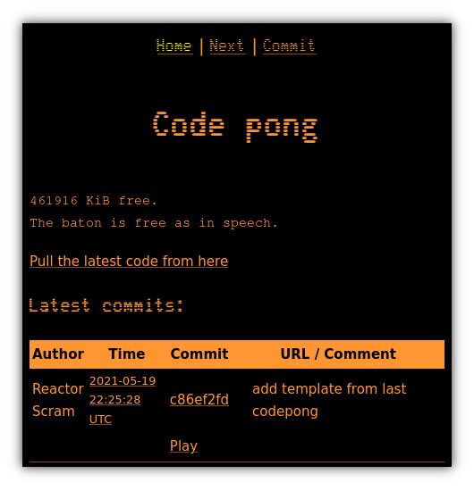

# Codepong

A re-implementation of https://openfu.com/codepong/

Codepong is a [Git forge](https://en.wikipedia.org/wiki/Forge_\(software\)) that lets
multiple gamedevs collaborate on a project. The developers take turns making small
changes to the game, like a many-player version of ping-pong, but with code.

Features:

- Shows the last few commits on the home page
- HTML5 games can be played directly on the codepong web server
- "Baton" feature allows devs to take exclusive locks on the right to commit for 1 hour
- IRC bot notifies when a commit is made or when the baton is taken
- Git clients can fetch / pull directly from the codepong server

Setup:

- Admin creates the server's game repo and starts the server
- Other devs clone from the server's repo and push to their public read-only Github / Gitlab / Gitea instances

Playing:

Using an honor system, devs take turns doing these steps:

1. Grab the baton with "Next"
2. Pull the newest code from the central server
3. Make a small modification within 1 hour
4. Push your change to your own public-readable Git repo
5. Use "Commit" to make the server fast-forward to your change. This 
also surrenders the baton immediately.
